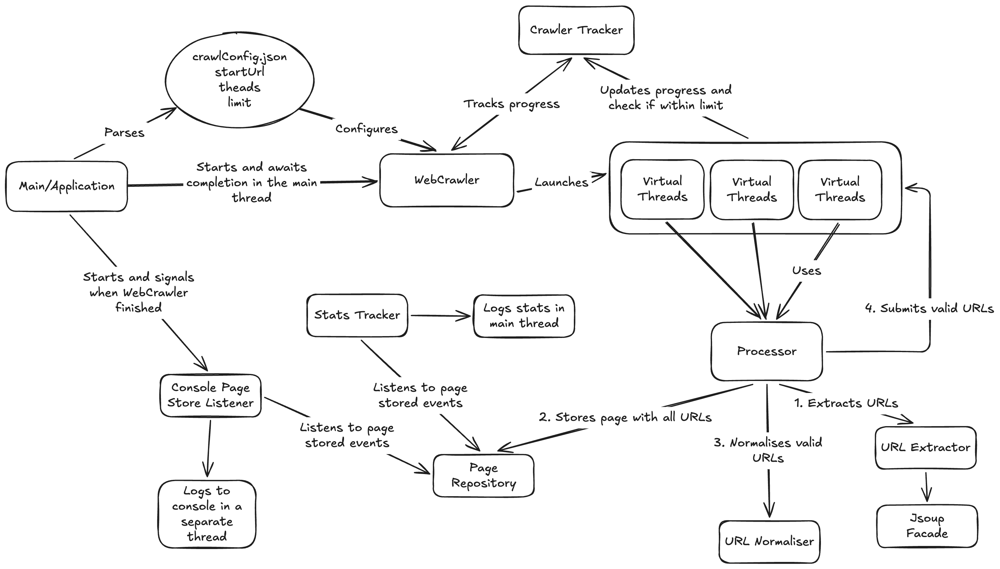

# Web Crawler

## Task

Given a starting URL, the crawler should visit each URL it finds on the same domain. 
It should print each URL visited, and a list of links found on that page. 
The crawler should be limited to one subdomain - so when you start with *https://crawlme.monzo.com/*, 
it would crawl all pages on the crawlme.monzo.com website, but not follow external links, 
for example to facebook.com, monzo.com or community.monzo.com.

## Architecture



## Usage

The default configuration will run the crawler for https://crawlme.monzo.com with 20 virtual threads up to 500 unique links visited/crawled.
The configuration can be changed as described in [Implementation Details](#implementation-details).

Once the configuration is chosen, the application can be built and run using the following two commands:

```shell
# build docker image
docker build -t web-crawler .
```

```shell
# run and remove once finished
docker run --rm --name web-crawler web-crawler
```

The application can be also run without a docker environment, make sure you have the Java 21 installed and active on your path.

```shell
# run the tests and builds jars
./gradlew clean build
```

```shell
# run the fat jar with all dependencies
java -jar build/libs/web-crawler-1.0-SNAPSHOT-all.jar
```

```shell
# run all tests
./gradlew clean test
```

## Implementation Details

Application is written using Java 21.
The configuration of the app is provided via JSON file [crawlConfig.json](src/main/resources/application/config/crawlConfig.json).

```text
startUrl            -> Web Crawler will use this URL as starting point, must be a valid URL
numberOfThreads     -> Web Crawler uses that number of JVM Virtual Threads to crawl, must be 0 < x <= 30
numberOfUrlsToCrawl -> Web Crawler will stop once it reaches that number of crawled URLs, must be x > 0
```

Project structure

```text
com.monzo.webcrawler
|- application      -> web crawler 
|- bootstrap        -> application context, main wiring
|- domain           -> main model and interfaces
|- infrastructure   -> jsoup, in-memory repository and console output
```

## Implementation notes and possible improvements
1. The app does not map the domain model [Page](src/main/java/com/monzo/webcrawler/domain/model/Page.java)
into PageEntity and PageStored models for simplicity. The production app should have those models to ensure a single responsibility principle.
2. The app does not have any retry mechanism, rate limiting and circuit breaker implementations, again for simplicity. 
The production app should have those to ensure the crawled website is not overwhelmed and failed calls are retried.
3. The app does not handle different error responses when fetching documents. The production app should handle 4xx, 5xx and other library-specific errors.
3. In-memory repository was used for simplicity, a real persistence layer could be used to store the results durably.
4. The app can benefit from better monitoring (metrics) to better track the progress and overall stats.
5. Better multithreading control could be introduced, for example, via using Phaser.
5. A UI could be added to make the user experience of starting, configuring and using the app better.
6. The test coverage could be improved, for example, by adding architecture tests to make sure the structure of the app/layers will not be violated.
